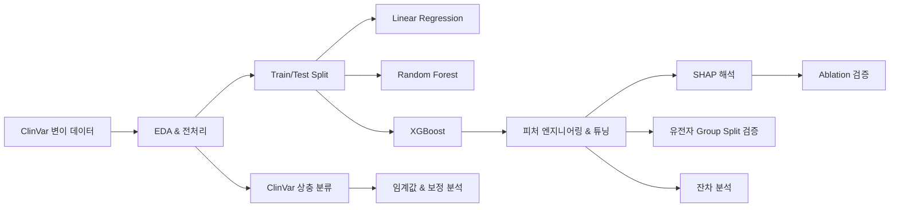
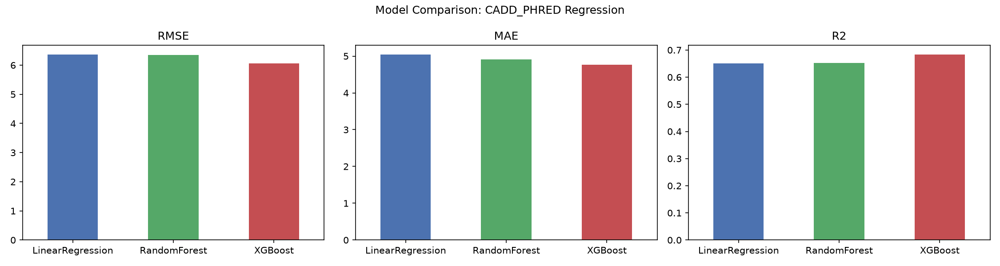
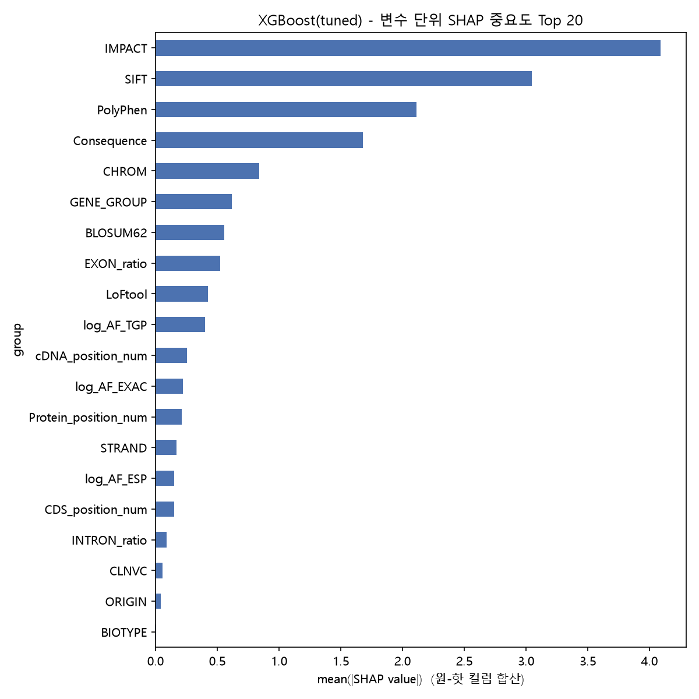
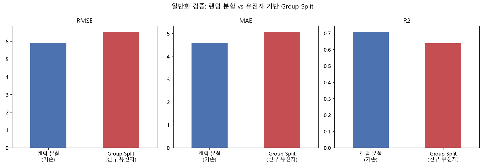
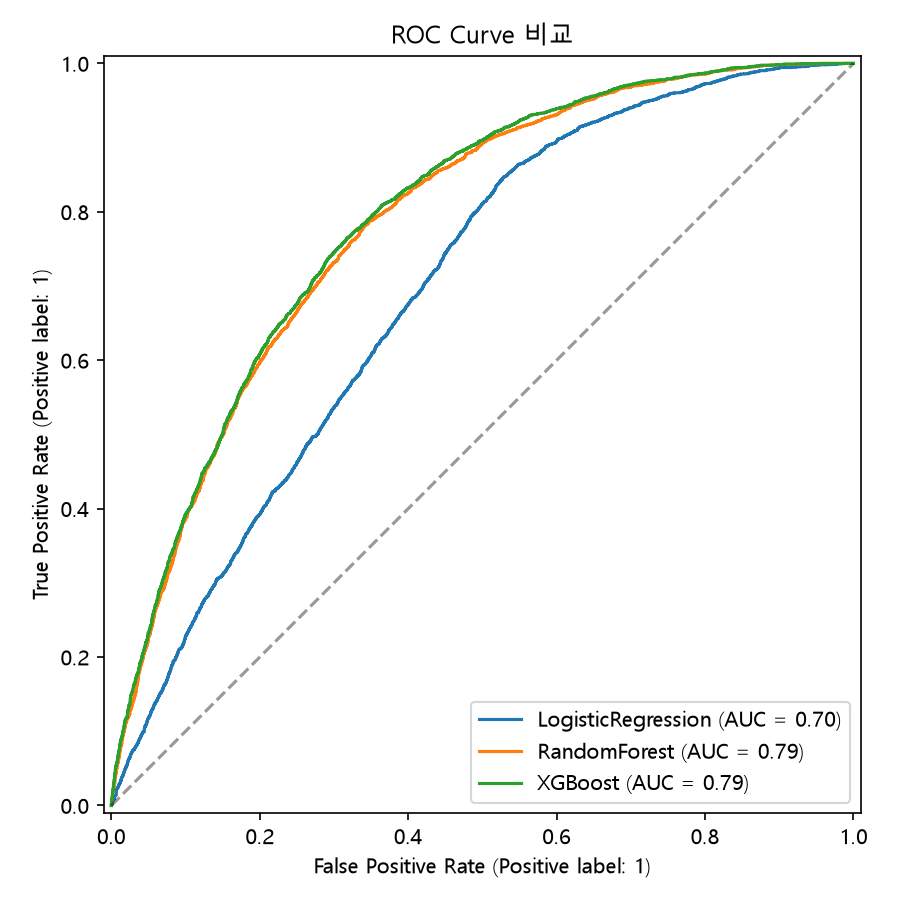

# Machine Learning for Clinical Variant Interpretation

> Predicting CADD deleteriousness scores and ClinVar interpretation conflicts with explainable machine learning

이 프로젝트는 ClinVar 유전 변이 데이터를 이용해 (1) 변이의 유해성 우선순위화 점수(`CADD_PHRED`)를 회귀로 예측하고, (2) ClinVar 검사기관 간 해석 상충 여부(`CLASS`)를 분류로 예측한 뒤, SHAP 해석·ablation 실험·유전자 기반 일반화 검증·통계적 가설검정으로 결과를 다각도로 검증한 머신러닝 연구/포트폴리오 프로젝트다.

> **이 프로젝트는 연구·포트폴리오 목적의 머신러닝 프로젝트이며, 임상 변이 분류 시스템이나 진단 도구가 아니다.** `CADD_PHRED`는 ACMG/AMP 병원성(pathogenicity) 분류가 아니며, `CLASS`는 병원성/양성 여부가 아니라 검사기관 간 해석 상충 여부를 나타낸다. 자세한 내용은 [`docs/limitations.md`](docs/limitations.md) 참고.

## 핵심 결과 (Key Findings)

| 65,188 | 0.708 | ~0.64–0.65 | 0.598 | 0.791 |
|---|---|---|---|---|
| ClinVar 변이 수 | 최종 holdout R² (튜닝된 XGBoost) | 미지 유전자(Group Split) R² | SIFT+PolyPhen 제외 시 R² | 상충 예측(CLASS) ROC-AUC |

## 파이프라인



이 프로젝트가 전달하려는 메시지는 단순히 "XGBoost가 가장 좋았다"가 아니라, **모델을 비교하고, 왜 잘 작동하는지 조사하고, ablation으로 feature importance를 검증하고, 미지 유전자에 대한 일반화를 테스트하고, 실패 모드를 분석했다**는 것이다.

## 연구 질문

**Q1. 예측** — 대립유전자 빈도, 변이 위치, 유전자 등의 특성으로 `CADD_PHRED`를 예측할 수 있는가?

**Q2. 해석** — 어떤 특성이 예측을 주도하며, SHAP에서 중요하다고 나온 특성들이 실제로 제거했을 때도 중요한가?

**Q3. 일반화** — 훈련에 등장하지 않은 유전자에 대해서도 모델 성능이 유지되는가?

**보조 과제** — 유전체 특성만으로 ClinVar 레코드의 검사기관 간 해석 상충 여부를 예측할 수 있는가?

## 데이터

- **원본**: [ClinVar Conflicting Classifications](https://www.kaggle.com/datasets/kevinarvai/clinvar-conflicting) (Kaggle) — `data/raw/clinvar_conflicting.csv` (65,188행 × 46열)
- **회귀 타겟**: `CADD_PHRED` — 변이의 잠재적 유해성(deleteriousness)을 우선순위화하는 점수 (결측 1.68%). **ACMG/AMP 병원성 분류가 아니다.**
- **보조 타겟**: `CLASS` — ClinVar 검사기관 간 해석 상충 여부(이진값, 0: 비상충 74.8% / 1: 상충 25.2%)
- **훈련/테스트 분할**: `data/processed/train.csv` / `test.csv` (80/20, `random_state=42`, 참고용 스냅샷) — 상세는 [`data/README.md`](data/README.md) 참고

## 결과 요약 (holdout 테스트 기준)

| 단계 | 모델 | RMSE | MAE | R² |
|---|---|---|---|---|
| Baseline | LinearRegression | 6.366 | 5.044 | 0.651 |
| Baseline | RandomForest | 6.164 | 4.814 | 0.672 |
| Baseline | XGBoost | 6.063 | 4.769 | 0.683 |
| +피처엔지니어링 | XGBoost | 5.856 | 4.583 | 0.704 |
| **+튜닝** | **XGBoost** | **5.817** | **4.537** | **0.708** |



대립유전자 빈도·변이 위치·유전자·기능적 영향 정보로 `CADD_PHRED` 변동의 약 71%를 설명 가능하다(순수 평균 예측 기준선 R²=0 대비). 상세 방법론은 [`docs/methodology.md`](docs/methodology.md) 참고.

### 피처 엔지니어링 vs. 하이퍼파라미터 튜닝

```
피처 엔지니어링 기여:  R² +0.021 (0.683 → 0.704)
하이퍼파라미터 튜닝 기여: R² +0.004 (0.704 → 0.708)
```

로그변환·위치 정보 파싱 같은 도메인 지식 기반 피처 엔지니어링이 하이퍼파라미터 튜닝보다 더 큰 성능 개선을 가져왔다 — 유사한 문제에서는 튜닝보다 피처 엔지니어링을 우선하는 것이 효율적일 수 있다는 실무적 시사점.

## SHAP 해석에서 실험적 검증까지

```
SHAP: IMPACT > SIFT > PolyPhen > Consequence 순으로 중요
        ↓
질문: SIFT/PolyPhen은 CADD와 개념이 겹치니 다른 특성과 중복 정보 아닌가?
        ↓
Ablation: SIFT + PolyPhen 제외하고 재학습
        ↓
R² 0.708 → 0.598 (15.5%↓)
        ↓
해석: SHAP 예상과 반대 — 두 변수는 다른 특성이 포착하지 못하는
      독립적인 예측력을 갖고 있음. SHAP 중요도만으로는 "대체 가능성
      (중복 여부)"을 판단할 수 없고, ablation이 필요함을 확인.
```




## 미지 유전자에 대해서도 일반화되는가?

```
랜덤 train/test 분할
        ↓
test 유전자의 95.7%가 train에도 존재
        ↓
다소 낙관적인 평가 가능성 (R²=0.709)
        ↓
유전자 기반 Group Split (완전히 새로운 유전자)
        ↓
R²가 0.709 → 0.639로 하락 (GroupKFold 5-fold로도 재현: R²=0.653±0.025)
```



**해석**: 더 현실적인 미지 유전자 설정에서 성능이 하락한 것은 기존 랜덤 분할이 낙관적이었음을 보여주지만, 모델은 여전히 단순 유전자 암기를 넘어서는 유의미한 예측 신호를 유지했다. Gene Group Split은 미지 유전자에 대한 더 엄격한 성능 추정치를 제공할 뿐, 임상적 일반화를 증명하는 것은 아니다. 상세: [`docs/model_validation.md`](docs/model_validation.md)

## 잔차 이상 패턴 원인 규명

잔차 플롯에서 실제값 23~36 구간에 보이던 "세로 띠"를 직접 조사한 결과, `CADD_PHRED`가 정수로 양자화되어 있어(예: 34.0이 1,431번 등장, 전체의 29.6%) 생긴 **시각적 착시**였다 — 밴드 내 잔차 표준편차(4.67)가 오히려 전체 평균(5.82)보다 낮았다. 다만 missense_variant/MODERATE 등급이 그룹 평균으로 수축하는 편향과, SIFT/PolyPhen이 "무해"로 판정해도 CADD는 높은 점수를 매기는 사례(BRCA1/2 등 주요 질병 유전자 포함)는 실재하는 한계로 확인됐다.


실제 변이 사례 4건(정확히 예측된 사례, 과소예측, 과대예측, ClinVar 상충 사례)은 [`docs/variant_case_studies.md`](docs/variant_case_studies.md) 참고.

## 보조 과제: ClinVar 해석 상충 예측

| 모델 | Accuracy | Precision | Recall | F1 | ROC-AUC |
|---|---|---|---|---|---|
| LogisticRegression | 0.560 | 0.348 | 0.854 | 0.495 | 0.696 |
| RandomForest | 0.714 | 0.457 | 0.712 | 0.557 | 0.786 |
| **XGBoost** | **0.717** | **0.461** | **0.724** | **0.564** | **0.791** |



모델은 어느 정도의 예측 신호(ROC-AUC 0.791)를 포착했지만, 상충 여부를 신뢰성 있게 판별하기에는 부족했다 — 이는 사용 가능한 유전체 주석을 넘어서는 증거(검사기관 간 기준 차이, 표현형 맥락 등)가 필요함을 시사한다. 상세 해석: [`docs/biological_interpretation.md`](docs/biological_interpretation.md)

## 잘 안 된 것 (What Did Not Work Well)

- **상충 분류(CLASS)**: ROC-AUC(0.791)는 그럴듯해 보이지만 F1(0.564)은 모델 상태를 더 정직하게 보여준다 — Accuracy(0.717)는 "전부 비상충으로 찍어도 0.748"이 나오는 불균형 데이터라 오해의 소지가 있다.
- **Precision-Recall 트레이드오프**: Precision을 0.70까지 올리면 Recall이 0.088로 붕괴 — 임계값 조정으로 해결되지 않는, 특성 신호 자체의 한계다.
- **일반화 격차**: 랜덤 분할(R²=0.709)은 test 유전자의 95.7%가 train에 존재해 낙관적이었고, 미지 유전자 기준 현실적 성능은 R²≈0.64~0.65다.
- **잔차 편향**: 그룹 평균으로 수축하는 경향과 SIFT/PolyPhen 의존으로 인한 특정 실패 사례(주요 질병 유전자 포함)가 남아있다.
- **분류기 확률 보정**: 예측 확률이 과대평가(overconfident) 상태 — 보정 곡선이 대각선 아래에 위치한다.

## 저장소 구조

```
data/       원본(raw/) 및 분할(processed/) 데이터
src/        분석 파이프라인 스크립트 (01~12번 순서, common.py 공통 모듈, utils/)
results/    연구 질문 단위 결과 (regression, explainability, generalization, classification, statistical_validation, biological_insights)
docs/       문제 정의, 방법론, 모델 검증, 생물학적 해석, 변이 사례 연구, 한계, AI 협업 워크플로우, 분석 리포트
notebooks/  포트폴리오 워크스루 노트북
```

## 문서

| 문서 | 내용 |
|---|---|
| [`docs/problem_definition.md`](docs/problem_definition.md) | 데이터 선정 이유, 핵심 질문, 회귀분석 기준선 |
| [`docs/methodology.md`](docs/methodology.md) | 데이터·전처리·모델·튜닝·평가지표 전체 방법론 |
| [`docs/model_validation.md`](docs/model_validation.md) | Holdout·Group Split·SHAP→Ablation·잔차·보정·임계값·실패 모드 |
| [`docs/biological_interpretation.md`](docs/biological_interpretation.md) | IMPACT/Consequence/SIFT/PolyPhen/유전자/ClinVar 상충의 생물학적 해석 |
| [`docs/variant_case_studies.md`](docs/variant_case_studies.md) | 실제 변이 4건 사례 연구 |
| [`docs/limitations.md`](docs/limitations.md) | 10가지 한계 (CADD≠병원성, 랜덤분할 낙관성, 데이터셋 시점 등) |
| [`docs/ai_assisted_workflow.md`](docs/ai_assisted_workflow.md) | Claude Code 협업 방식과 인간 검증 과정 |
| [`docs/analysis_report.md`](docs/analysis_report.md) / [`.pdf`](docs/analysis_report.pdf) | 종합 분석 리포트 (전체 11개 섹션) |
| [`docs/workflow.md`](docs/workflow.md) | 파이프라인 구조와 재현 실행 가이드 |
| [`docs/eda_summary.md`](docs/eda_summary.md) | EDA 수치 요약 |
| [`docs/development_log.md`](docs/development_log.md) | 작업 진행 이력 |
| [`data/README.md`](data/README.md) | 데이터셋 출처·라이선스·분할 방식 |

## 재현성 (Reproducibility)

```bash
git clone <repository>
cd genetic-variant-classifications

python -m venv .venv
# Windows: .venv\Scripts\activate
# macOS/Linux: source .venv/bin/activate

pip install -r requirements.txt
```

```bash
python src/01_eda.py                      # 탐색적 데이터 분석
python src/02_split_data.py               # 훈련/테스트 분할 (참고용)
python src/03_baseline_models.py          # 1차 모델 비교 (LR/RF/XGBoost)
python src/04_model_improvement.py        # 피처 엔지니어링 + CV + 하이퍼파라미터 튜닝 (~140분)
python src/05_shap_interpretation.py      # 튜닝된 XGBoost SHAP 해석
python src/06_ablation_analysis.py        # SIFT/PolyPhen 제외 ablation 실험
python src/07_statistical_validation.py   # CLASS/IMPACT/Consequence 그룹 간 통계적 가설검정
python src/08_conflict_classification.py  # CLASS(상충 여부) 분류로 확장
python src/09_threshold_analysis.py       # 분류 임계값 조정 Precision-Recall 트레이드오프
python src/10_gene_group_validation.py    # 유전자 기반 Group Split 일반화 검증
python src/11_residual_investigation.py   # 잔차 이상 패턴(23~36 구간) 원인 규명
python src/12_advanced_visualization.py   # 잔차플롯/PCA-tSNE/보정곡선/유전자히트맵/2D PDP
python src/utils/build_report_pdf.py      # docs/analysis_report.md -> docs/analysis_report.pdf (Chrome/Edge 필요)
```

파이프라인 세부 단계와 공통 규칙은 [`docs/workflow.md`](docs/workflow.md) 참고. 빠르게 결과만 훑어보려면 [`notebooks/portfolio_walkthrough.ipynb`](notebooks/portfolio_walkthrough.ipynb)(저장된 결과 파일만 로드, 재학습 불필요)를 권장한다.

## 한계

- `CADD_PHRED` ≠ ACMG/AMP 병원성 분류
- 랜덤 분할은 낙관적(test 유전자의 95.7%가 train에 존재) — Gene Group Split이 더 엄격하지만 완전한 외부 검증은 아님
- SIFT/PolyPhen/IMPACT/Consequence/CADD는 서로 개념이 겹치는 특성들
- ClinVar 상충 라벨은 검사기관 간 의견 불일치를 나타낼 뿐 절대적 병원성 여부가 아님
- 임상 배포 검증(prospective clinical validation)은 수행되지 않음

전체 10가지 한계는 [`docs/limitations.md`](docs/limitations.md) 참고.

## 향후 개선 방향

- 최신 ClinVar 데이터로 외부 검증(external validation)
- 시간 기반(time-based) ClinVar 분할 — 제출 시점 이후 데이터로 검증
- 염색체 기반(chromosome-based) holdout
- 유전자 계열(gene-family)·경로(pathway) 기반 Group Validation
- gnomAD 대립유전자 빈도 통합
- 더 풍부한 transcript 주석 활용
- 분류기 확률 보정(Platt scaling / isotonic regression)
- ACMG 근거 코드(evidence features) 기반 특성 추가
- 표현형/HPO 정보 통합
- 임상 지향 변이 분류기와의 비교

*(위 항목은 향후 방향 제안이며, 현재 구현되어 있지 않다.)*

---

*이 저장소는 Claude Code를 구현 보조 도구로 활용해 개발됐다. 인간-AI 협업 방식은 [`docs/ai_assisted_workflow.md`](docs/ai_assisted_workflow.md)에 투명하게 기록되어 있다.*
