# 분석 리포트: ClinVar 변이 병원성 점수(CADD_PHRED) 회귀 예측

## 1. 개요
- **데이터**: `data/clinvar_conflicting.csv` (ClinVar Conflicting Classifications, 65,188행 × 46열)
- **목표**: 대립유전자 빈도, 변이 위치, 유전자, 기능적 영향 등의 특성으로 변이의 병원성 점수(`CADD_PHRED`)를 예측하는 회귀 모델을 구축하고, 선형회귀·랜덤포레스트·XGBoost 세 모델을 RMSE·MAE·R²로 비교한다.
- 문제 정의와 선정 이유는 `docs/Problem-definition.md` 참고.

## 2. 데이터 설명
- 원본 타겟 `CLASS`(임상 해석 상충 여부, 이진값)는 0(비상충) 74.8%, 1(상충) 25.2%로 불균형 — 이번 회귀분석의 타겟이 아니라 참고용 변수로만 사용.
- 회귀 타겟 `CADD_PHRED`(연속형, 변이 유해성 점수)는 결측률 1.68%로 낮아 타겟으로 채택. 결측 행은 분석에서 제외.
- `MOTIF_*`, `DISTANCE`, `SSR`, `CLN*INCL` 등은 결측률 86~100%로 모델링에서 제외.
- 고카디널리티 변수: 유전자(`SYMBOL`) 2,328종, `Consequence` 48종 — 유전자는 상위 30종 + 기타로 그룹화하여 사용.

## 3. 탐색적 데이터 분석(EDA) 요약
전체 플롯: `outputs/eda/` (11개), 원자료 요약: `docs/eda_summary.md`

- **결측치**: 상위 결측 컬럼은 대부분 예측에 거의 쓸모없는 수준(90%+)으로 확인되어 제거 결정에 근거가 됨.
  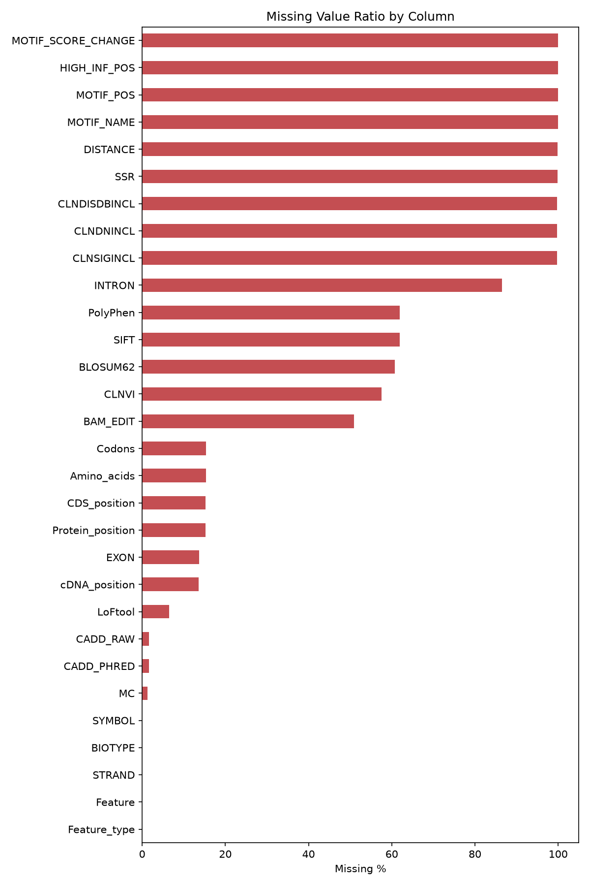
- **CADD_PHRED 분포**: 평균 15.7, 표준편차 10.8, 우측 꼬리가 긴 분포(0.001~99).
  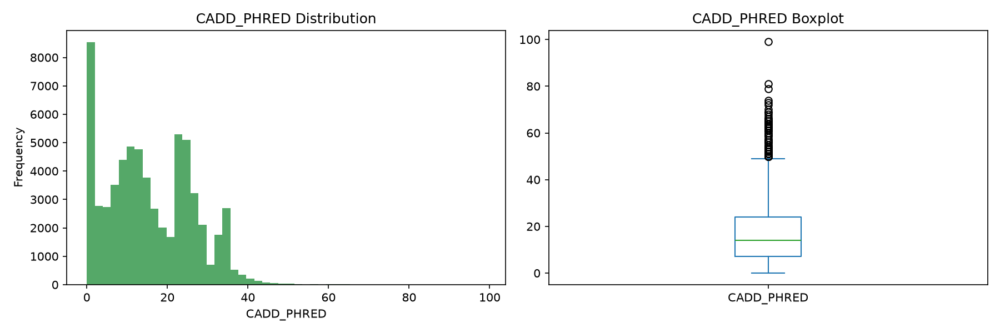
- **상관관계**: `CADD_RAW`와 `CADD_PHRED`는 상관계수 0.955로 사실상 동일 정보 → 특성에서 `CADD_RAW` 제외(데이터 누수 방지). `BLOSUM62`(아미노산 치환 점수)가 가장 강한 상관(-0.303), 대립유전자 빈도는 약한 음의 상관(-0.15~-0.17). `CLASS`는 `CADD_PHRED`와 거의 무관(-0.038) — 상충 여부와 유해성 점수는 독립적인 정보.
  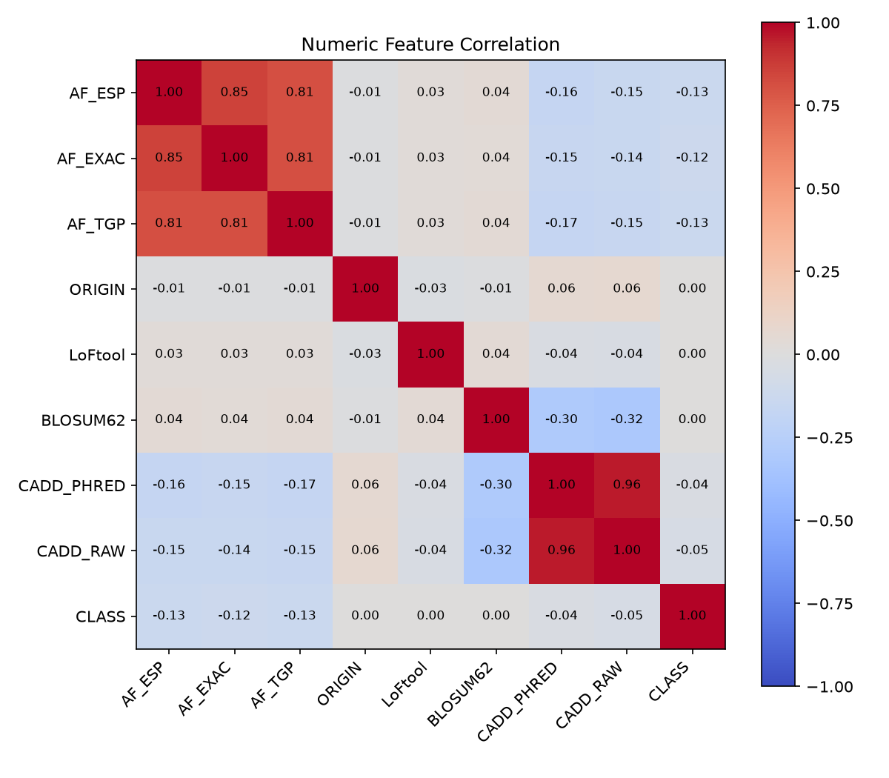
- **IMPACT별 차이**: HIGH 등급일수록 `CADD_PHRED` 중앙값이 뚜렷하게 높음 — 강력한 예측 변수로 확인.
  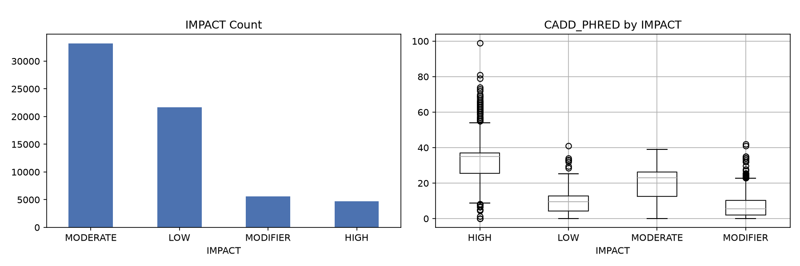
- **대립유전자 빈도**: 0값이 대부분(zero-inflated)이라 로그변환 등 추가 처리가 필요함을 확인.
  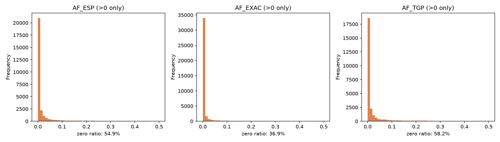

## 4. 회귀분석 기준선
| 기준선 | RMSE | MAE | R² |
|---|---|---|---|
| 순수 기준선 (훈련 평균만 예측) | 10.770 | 9.107 | 0.000 |
| 모델 기준선 (선형회귀, 원본 피처) | 6.366 | 5.044 | 0.651 |

선형회귀만으로도 순수 기준선 대비 RMSE 약 41% 감소, R² 0→0.65로 개선 — 특성들이 실질적인 설명력을 가짐을 확인. 상세: `docs/Problem-definition.md` 참고.

## 5. 모델 비교 (1차: 원본 피처, 기본 하이퍼파라미터)
학습/테스트 분할: 80/20 (`data/train.csv` / `data/test.csv`, random_state=42)

| 모델 | RMSE | MAE | R² |
|---|---|---|---|
| LinearRegression | 6.366 | 5.044 | 0.651 |
| RandomForest | 6.343 | 4.906 | 0.653 |
| **XGBoost** | **6.059** | **4.770** | **0.684** |

**해석**:
- XGBoost가 세 지표 모두에서 최우수 — IMPACT/Consequence/SIFT/PolyPhen 등 변수 간 비선형 상호작용을 트리 기반 모델이 더 잘 포착.
- RandomForest는 선형회귀 대비 근소한 개선에 그침 — 기본 하이퍼파라미터(트리 수 300, 깊이 제한 없음)로는 XGBoost의 부스팅 방식만큼의 이득을 내지 못함.
- XGBoost의 특성 중요도 상위 변수는 `outputs/feature_importance_XGBoost.png` 참고.

## 6. 모델 개선 (피처 엔지니어링 + 5-fold CV + 하이퍼파라미터 튜닝)
`scripts/model_improvement.py` 실행 결과 (동일 holdout 테스트셋, `outputs/model_improvement/`)

**엔지니어링 피처**: 대립유전자 빈도 로그변환(`log1p`), `EXON`/`INTRON` 비율 파싱, `Protein_position`/`CDS_position`/`cDNA_position` 수치화
**튜닝**: RandomizedSearchCV (`n_iter=10, cv=3, scoring=neg_root_mean_squared_error`), RandomForest·XGBoost 대상

| 단계 | 모델 | RMSE | MAE | R² |
|---|---|---|---|---|
| Baseline | LinearRegression | 6.366 | 5.044 | 0.651 |
| Baseline | RandomForest | 6.164 | 4.814 | 0.672 |
| Baseline | XGBoost | 6.063 | 4.769 | 0.683 |
| +피처엔지니어링 | LinearRegression | 6.360 | 5.037 | 0.651 |
| +피처엔지니어링 | RandomForest | 5.938 | 4.607 | 0.696 |
| +피처엔지니어링 | XGBoost | 5.856 | 4.583 | 0.704 |
| +튜닝 | RandomForest | 5.895 | 4.576 | 0.700 |
| **+튜닝** | **XGBoost** | **5.817** | **4.537** | **0.708** |

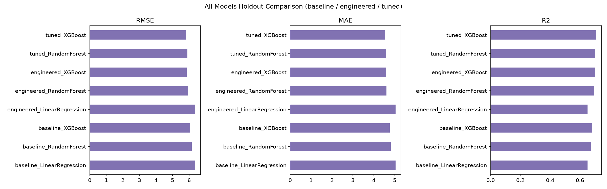
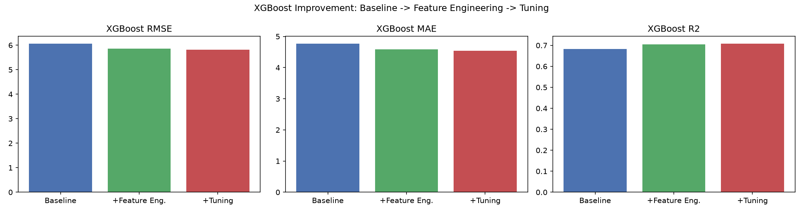

**해석**:
- 최종 최우수 모델은 **튜닝된 XGBoost** (R²=0.708) — baseline XGBoost(0.683) 대비 RMSE 8.6% 감소, R² +0.057.
- **피처 엔지니어링의 효과가 하이퍼파라미터 튜닝보다 크다**: XGBoost 기준 피처 엔지니어링만으로 R²가 0.683→0.704로 개선(+0.021)된 반면, 이후 튜닝의 추가 개선은 0.704→0.708(+0.004)에 그침. RandomForest도 동일 패턴(엔지니어링 +0.024 vs 튜닝 +0.004) — 대립유전자 빈도 로그변환과 위치 정보 수치화가 실질적인 정보를 더했다는 뜻.
- 선형회귀는 피처 엔지니어링으로 거의 개선되지 않음(0.651→0.651) — 로그변환·위치 정보가 비선형적으로 작용하기 때문에 트리 기반 모델에서만 효과가 나타남.
- 5-fold CV 표준편차가 ±0.004~0.006(R² 기준)로 작아 결과가 안정적임을 확인 (`outputs/model_improvement/results.json`).

## 7. 모델 해석 (SHAP)
`scripts/shap_interpretation.py` 실행 결과 — 튜닝된 XGBoost(R²=0.708)를 SHAP `TreeExplainer`로 해석 (`outputs/shap/`)

**변수 단위 중요도** (원-핫 인코딩된 컬럼들을 원본 변수 기준으로 합산, Top 10)

| 순위 | 변수 | mean(\|SHAP\|) |
|---|---|---|
| 1 | IMPACT | 4.089 |
| 2 | SIFT | 3.046 |
| 3 | PolyPhen | 2.112 |
| 4 | Consequence | 1.680 |
| 5 | CHROM | 0.838 |
| 6 | GENE_GROUP | 0.615 |
| 7 | BLOSUM62 | 0.557 |
| 8 | EXON_ratio | 0.524 |
| 9 | LoFtool | 0.424 |
| 10 | log_AF_TGP | 0.400 |

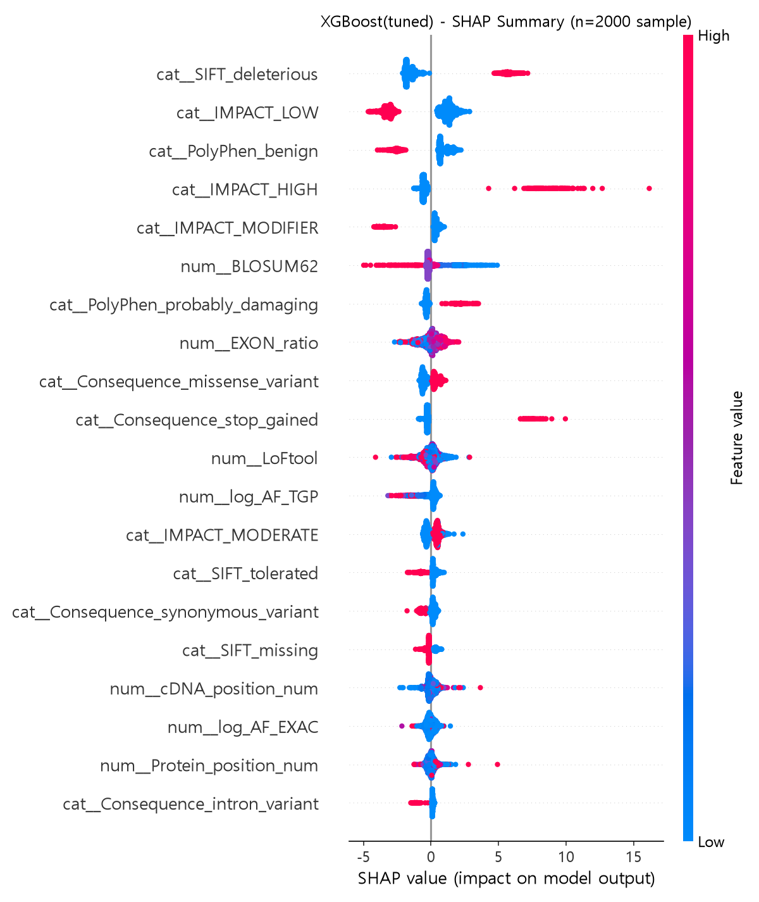
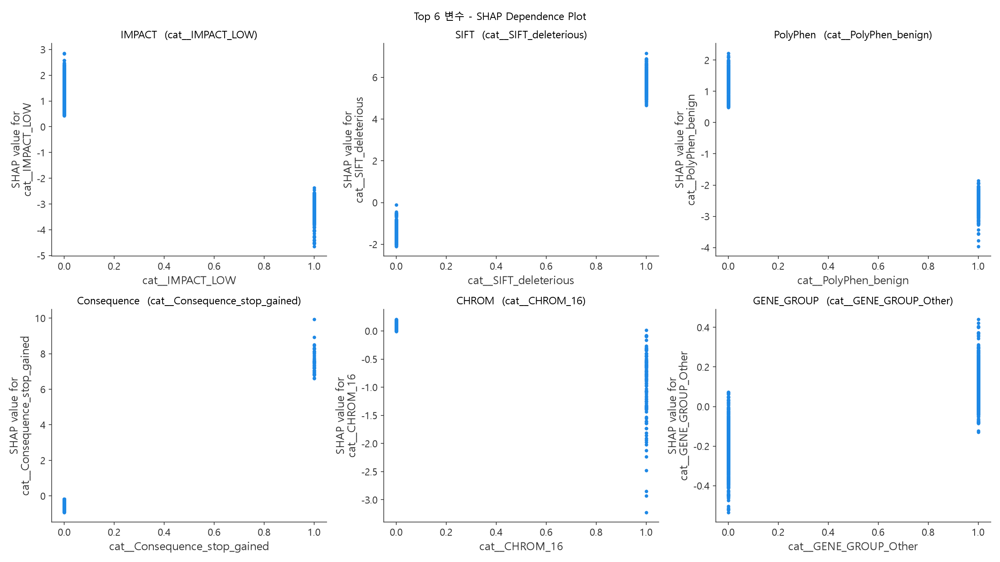

**해석**:
- 상위 4개(IMPACT, SIFT, PolyPhen, Consequence)가 모두 변이의 기능적 영향/유해성을 나타내는 변수. 특히 **SIFT·PolyPhen이 2·3위로 비중이 매우 큰데**, 이 둘은 CADD와 별개의 도구지만 같은 개념(단백질 기능 손상)을 측정하므로 모델이 크게 의존하고 있다 — 3장 EDA에서 우려했던 "정보 중복" 가능성이 SHAP에서도 확인됨. → 아래 ablation 실험으로 검증.
- `EXON_ratio`(피처 엔지니어링으로 추가한 변수)가 9위에 랭크 — 6장에서 확인한 피처 엔지니어링의 효과를 변수 단위로도 재확인.
- 대립유전자 빈도(`log_AF_TGP` 등)는 하위권이지만 0보다 뚜렷이 큰 기여 — 흔한 변이일수록 병원성이 낮다는 EDA의 상관관계 방향과 일치.

### 7-1. Ablation 실험: SIFT/PolyPhen 제외
`scripts/ablation_sift_polyphen.py` 실행 결과 (`outputs/ablation/`) — SHAP에서 제기된 "정보 중복" 가능성을 검증하기 위해, 튜닝된 XGBoost를 SIFT·PolyPhen 없이 동일 조건으로 재학습.

| 구성 | RMSE | MAE | R² |
|---|---|---|---|
| Full (SIFT+PolyPhen 포함) | 5.817 | 4.537 | 0.708 |
| SIFT+PolyPhen 제외 | 6.826 | 5.297 | 0.598 |

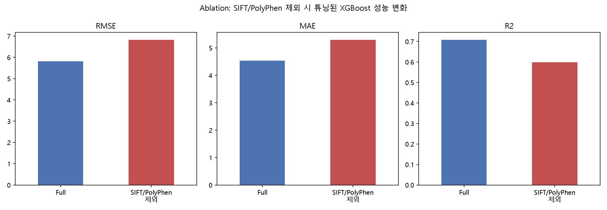

**해석 (SHAP 예상과 반대되는 결과)**: R²가 0.708→0.598로 15.5% 하락, RMSE는 17% 증가 — 예상보다 훨씬 크게 떨어졌다. SHAP 중요도만 보고 "CADD와 개념이 겹치니 중복 정보일 것"이라 추정했지만, 실제로는 SIFT·PolyPhen이 IMPACT·Consequence·BLOSUM62 등 다른 특성이 포착하지 못하는 **독립적인 예측 정보**(서로 다른 알고리즘·보존성 모델 기반의 단백질 기능 예측)를 상당 부분 담고 있었다는 뜻이다. SHAP 중요도가 높다고 해서 그 변수가 다른 변수로 대체 가능(중복)하다는 것은 아니며, 실제 기여도는 이렇게 직접 제외해보는 ablation으로만 확인할 수 있다는 것이 이번 실험의 핵심 교훈이다.

## 8. 분류로 확장: CLASS(임상 해석 상충 여부) 예측
`scripts/classify_conflicting.py` 실행 결과 (`outputs/classification/`) — 원본 데이터셋의 취지인 `CLASS`(0: 비상충 74.8%, 1: 상충 25.2%)를 별도 분류 문제로 예측. 특성은 회귀와 동일 + `CADD_PHRED`를 특성으로 추가(타겟이 CLASS이므로 누수 아님). 클래스 불균형은 `class_weight="balanced"`(LR/RF), `scale_pos_weight`(XGB)로 보정.

| 모델 | Accuracy | Precision | Recall | F1 | ROC-AUC |
|---|---|---|---|---|---|
| LogisticRegression | 0.560 | 0.348 | 0.854 | 0.495 | 0.696 |
| RandomForest | 0.714 | 0.457 | 0.712 | 0.557 | 0.786 |
| **XGBoost** | **0.717** | **0.461** | **0.724** | **0.564** | **0.791** |

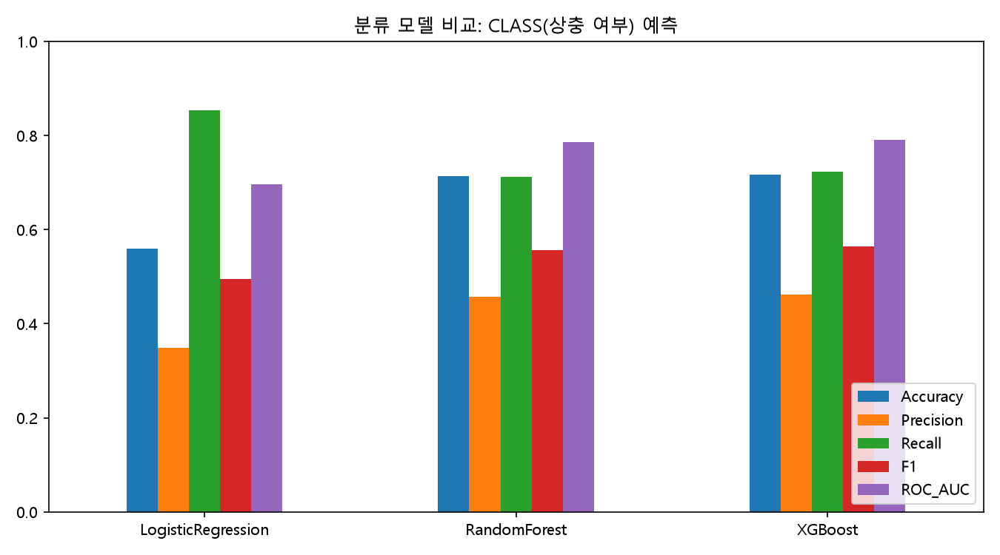
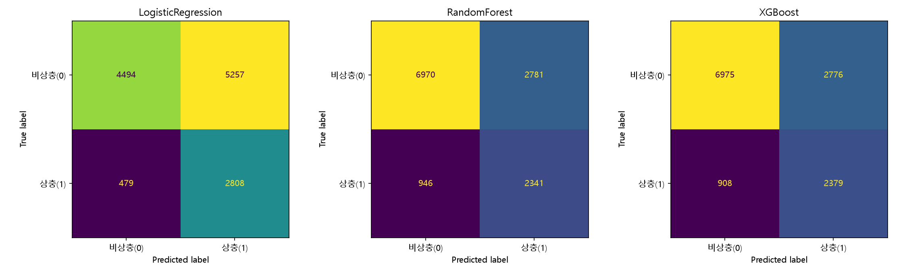

**해석**:
- XGBoost가 ROC-AUC 0.791로 최우수하나, 회귀(R²≈0.71)만큼 깔끔하지 않다 — "상충 여부"는 검사기관 간 판단 차이라는 인간적 요인이 섞여 있어 변이 특성만으로는 예측이 더 어려운 문제.
- Accuracy(0.717)는 오해의 소지가 있다 — 전부 0(비상충)으로 찍어도 Accuracy 0.748이 나오는 불균형 데이터이므로 **ROC-AUC·F1이 더 신뢰할 만한 지표**.
- LogisticRegression은 `class_weight="balanced"`로 인해 Recall(0.854)은 높지만 Precision(0.348)이 낮아 상충을 과도하게 예측하는 경향. 트리 모델(RF/XGB)이 Precision·Recall 균형이 더 좋음.
- XGBoost feature importance 상위권: `IMPACT_HIGH`, 대립유전자 빈도(`log_AF_TGP`, `log_AF_EXAC`), 특정 유전자(`LDLR`, `RAD50`, `APC`, `MYBPC3`, `MSH6`, `BRCA1`, `BRCA2`, `NF1`) — 잘 알려진 질병 유전자일수록 여러 검사기관이 제출·검토하는 빈도가 높아 해석 상충 가능성도 높아지는 것으로 해석됨 (`outputs/classification/feature_importance_XGBoost.png`).

### 8-1. 임계값(threshold) 조정 — Precision-Recall 트레이드오프
`scripts/threshold_analysis.py` 실행 결과 (`outputs/threshold_analysis/`) — XGBoost 분류기의 판정 임계값을 조정했을 때 Precision·Recall이 어떻게 변하는지 분석. Average Precision(AP) = 0.533 (양성 비율 0.252 대비 2배 이상 — 어느 정도 판별력 있음).

| 시나리오 | 임계값 | Precision | Recall | F1 |
|---|---|---|---|---|
| 기본 (0.5) | 0.500 | 0.461 | 0.724 | 0.564 |
| F1 최대화 | 0.495 | 0.460 | 0.737 | **0.566** |
| 고재현율 (Recall≥0.9) | 0.344 | 0.375 | 0.900 | 0.529 |
| 고정밀 (Precision≥0.7) | 0.810 | 0.700 | 0.088 | 0.157 |

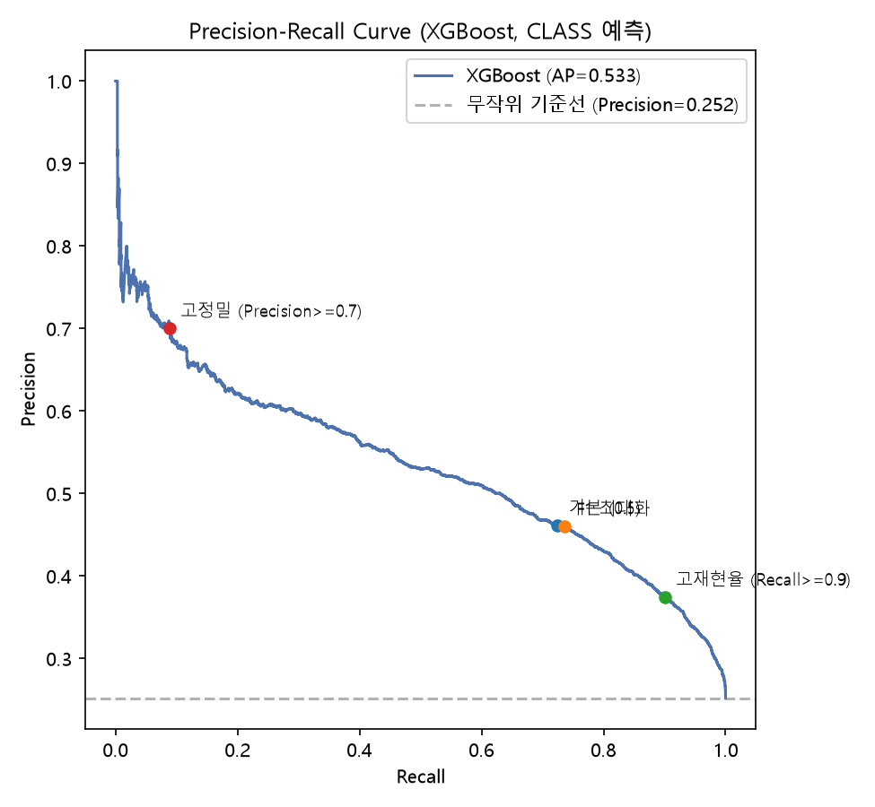
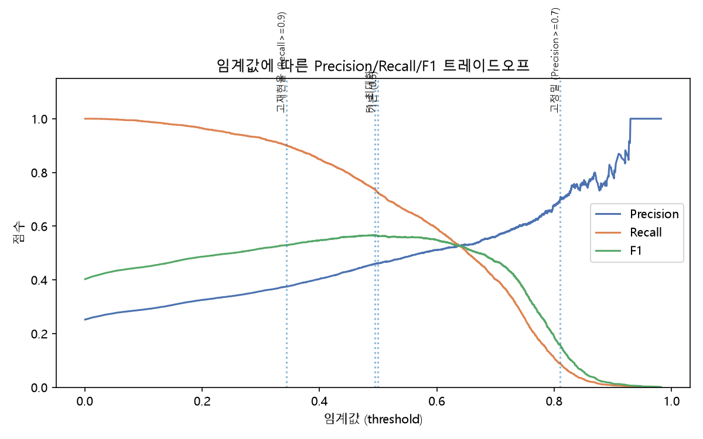

**해석**:
- 기본 임계값(0.5)이 이미 F1 최적점에 매우 가깝다 — 조정해도 F1은 0.564→0.566으로 거의 개선되지 않아, 임계값 튜닝 자체로 얻는 이득은 크지 않다. 대신 Precision과 Recall 중 어느 쪽을 우선할지 고르는 용도로 의미가 있다.
- **고정밀 시나리오의 실용성이 낮다**: Precision을 0.70까지 올리려면 임계값을 0.81까지 높여야 하는데, 그러면 Recall이 0.088로 붕괴 — 실제 상충 변이의 91%를 놓친다. 모델이 "확실히 상충"이라고 자신 있게 말할 수 있는 고신뢰 구간이 거의 없다는 뜻이다.
- 고재현율 시나리오(Recall 0.9, Precision 0.375)는 "상충 가능 변이를 놓치지 않는" 스크리닝 목적에는 상대적으로 현실적인 선택지다.
- 종합하면 `CLASS` 분류는 임계값 조정으로 해결되는 문제가 아니라 특성 자체가 담고 있는 신호의 한계에 가깝다 — 9장 가설검정에서 확인한 CLASS의 약한 효과크기(Cohen's d=-0.087, CADD_PHRED 기준)와 같은 맥락이다.

## 9. 통계적 가설검정
`scripts/statistical_tests.py` 실행 결과 (`outputs/stats/`) — 표본이 커서(n≈6만) p-value만으로는 "통계적 유의"와 "실질적 의미"를 구분하기 어려우므로 효과크기(Cohen's d, eta-squared)를 함께 계산.

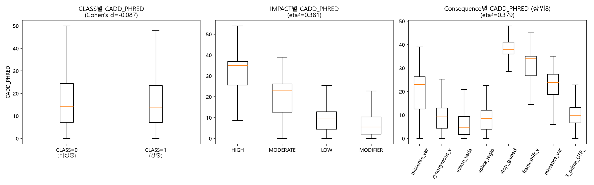

**Test A. CLASS(상충 여부)에 따른 CADD_PHRED 차이**
- CLASS=0 평균 15.924 vs CLASS=1 평균 14.986
- Welch's t-test p=2.3e-23, Mann-Whitney p=1.1e-14 → 통계적으로 유의
- **Cohen's d = -0.087 (무시할 수준)** → 표본이 커서 유의하게 나왔을 뿐 실질적 차이는 거의 없음. EDA에서 확인한 "CLASS와 CADD_PHRED 상관계수 -0.038"과 일관됨.

**Test B. IMPACT 등급에 따른 CADD_PHRED 차이**
- HIGH(33.0) > MODERATE(19.6) > LOW(8.8) > MODIFIER(6.8)
- Kruskal-Wallis p≈0, **eta²=0.381 (큰 효과)** — 통계적으로도 실질적으로도 확실한 차이
- 사후검정(Bonferroni 보정, 6개 쌍): 전부 유의 — 네 등급이 서로 뚜렷하게 구분됨

**Test C. Consequence 유형별 CADD_PHRED 차이 (상위 8개)**
- stop_gained(39.5), frameshift_variant(31.1)가 가장 높고 intron_variant(6.2)가 가장 낮음
- Kruskal-Wallis p≈0, **eta²=0.379 (큰 효과)**

**해석**: 가설검정 결과가 지금까지의 회귀·SHAP 결과를 통계적으로 뒷받침한다 — `IMPACT`·`Consequence`는 `CADD_PHRED`에 크고 실질적인 영향(eta²≈0.38)을 주는 반면, `CLASS`는 통계적으로만 유의할 뿐 실질적 영향은 거의 없다(d=-0.087). 이는 회귀 모델에서 `CLASS`를 특성으로 사용하지 않은 설계, 그리고 SHAP·XGBoost feature importance에서 CLASS 관련 정보가 상위권에 없었던 것과 일관된다.

## 10. 심화 시각화
`scripts/advanced_visualizations.py` 실행 결과 (`outputs/advanced_viz/`) — 튜닝된 XGBoost 회귀/분류 모델을 5가지 각도에서 추가로 시각화.

> 첫 실행 시 PCA/t-SNE는 스케일링을 적용하지 않아(트리 모델용 preprocessor 재사용) 위치 정보 등 스케일이 큰 변수가 지배해 설명분산이 100%로 무의미하게 나왔고, 2D PDP는 `BLOSUM62`(결측 60%)의 NaN이 섞인 채로 sklearn이 `np.percentile`을 사용해 그리드 범위가 깨졌다. PCA/t-SNE 전용 `StandardScaler` preprocessor를 별도 적용하고 PDP 입력의 결측을 중앙값으로 채워 재실행해 바로잡았다.

**10-1. 회귀 잔차 플롯**
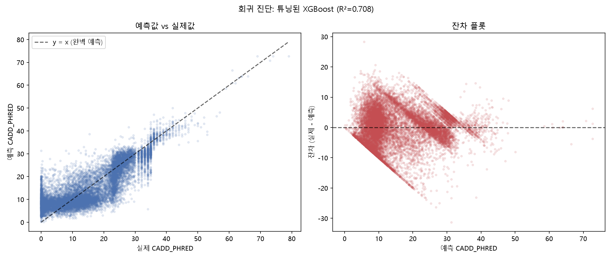
- 대체로 y=x를 잘 따르나, 실제 CADD_PHRED가 40 이상인 고유해성 변이에서 모델이 체계적으로 과소예측하는 꼬리 압축(tail compression) 경향이 있다.
- 실제값 23~36 구간에 세로로 밀집된 띠가 있고 이 구간에서 예측값이 0~40까지 크게 흩어진다 — 특정 Consequence/IMPACT 조합이 겹쳐 나타나는 것으로 보이며, 후속 분석에서 원인 특정이 필요하다.

**10-2. PCA / t-SNE 2D 임베딩**
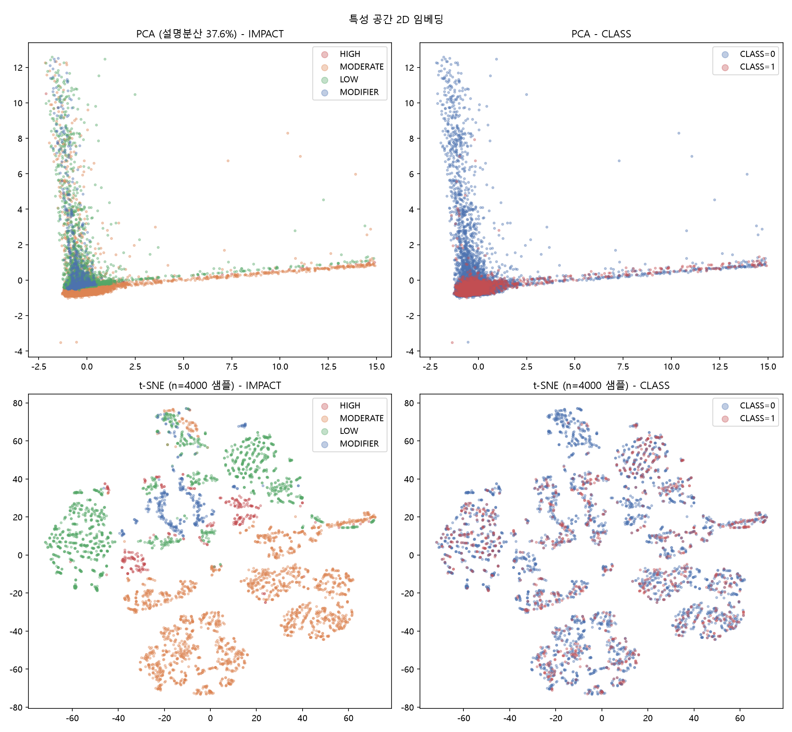
- t-SNE에서 `IMPACT` 등급별로 뚜렷한 군집이 형성된다(LOW/MODERATE가 서로 다른 영역을 차지).
- `CLASS`(상충 여부)는 모든 군집에 고르게 섞여 있어 특성 공간에서 구분되는 영역이 없다 — 9장 가설검정(d=-0.087)과 SHAP 결과를 시각적으로 재확인.

**10-3. 분류기 보정 곡선**
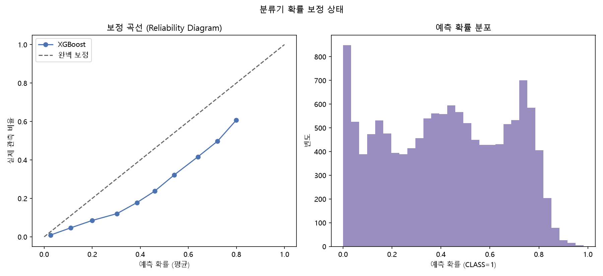
- XGBoost 분류기의 예측 확률이 전반적으로 과대평가(overconfident)되어 있다 — 보정 곡선이 대각선 아래에 위치해, 예측 확률 0.8 구간에서 실제 관측 비율은 약 0.61에 그친다.
- `scale_pos_weight`로 클래스 불균형을 보정하면서 생긴 부작용으로 추정된다. 확률값 자체의 신뢰도가 필요한 용도(예: 위험도 커뮤니케이션)라면 Platt scaling 등 별도 보정이 필요하다.

**10-4. 유전자 x IMPACT 히트맵**
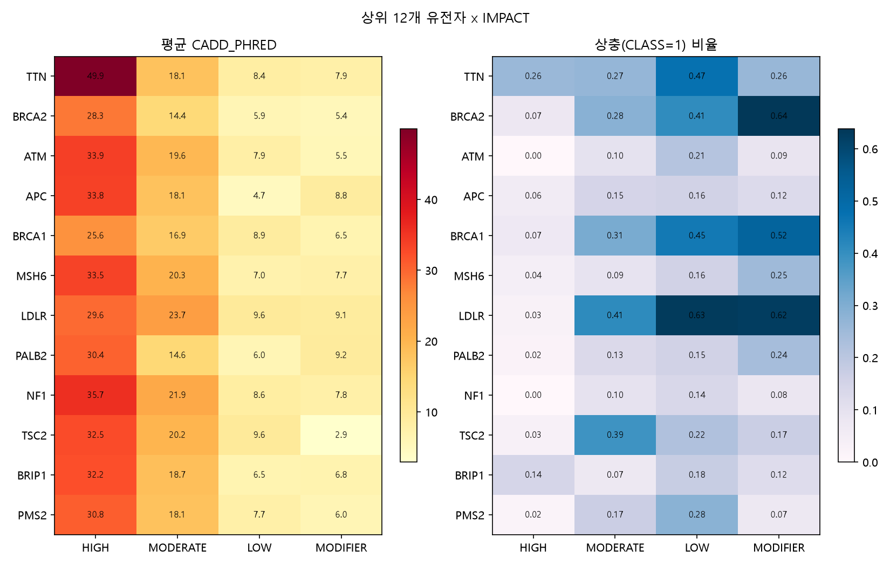
- 상위 12개 유전자(TTN, BRCA2, ATM, APC, BRCA1, MSH6, LDLR, PALB2, NF1, TSC2, BRIP1, PMS2 — 대부분 암/심장질환 관련 주요 질병 유전자) 기준, HIGH 등급에서는 거의 모든 유전자의 상충 비율이 낮지만(0~0.14) LOW/MODIFIER 등급에서는 급증한다(LDLR LOW=0.63, BRCA2 MODIFIER=0.64, BRCA1 MODIFIER=0.52).
- "명백히 위험한 변이"는 검사기관들이 대체로 동의하지만, "애매한 변이"에서 해석이 크게 갈린다는 것을 유전자 단위로 재확인 — 8장 분류 결과의 구체적 근거가 된다.

**10-5. 2D Partial Dependence: BLOSUM62 x log_AF_TGP**
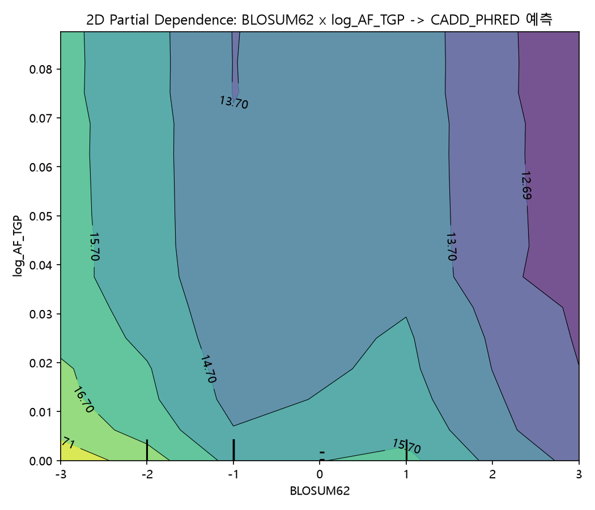
- 예측 CADD_PHRED는 BLOSUM62가 낮을수록(아미노산 치환이 급격할수록) 높다(~16.7 → ~12.7). 대립유전자 빈도가 낮을 때 이 효과가 더 뚜렷하게 나타나 두 변수 간 상호작용이 존재함을 확인했다.

## 11. 결론 및 다음 단계
- 유전 변이의 대립유전자 빈도·변이 위치·유전자·기능적 영향 정보로 `CADD_PHRED`의 상당 부분(R²≈0.71)을 설명할 수 있음을 확인했다.
- 피처 엔지니어링(로그변환, 위치 정보 수치화)이 하이퍼파라미터 튜닝보다 더 큰 성능 개선을 가져왔다 — 향후 유사 작업에서는 튜닝보다 도메인 지식 기반 피처 엔지니어링을 우선하는 것이 효율적일 수 있다.
- SHAP 해석 결과 모델은 SIFT·PolyPhen에 크게 의존하며, ablation 실험으로 검증한 결과 이 둘을 제외하면 R²가 0.708→0.598(15.5%↓)로 크게 하락 — 두 변수가 단순 중복 정보가 아니라 다른 특성이 포착하지 못하는 독립적인 예측력을 갖고 있음을 확인했다.
- `CLASS`(상충 여부) 분류로 확장한 결과 ROC-AUC 0.791로 회귀보다는 어려운 문제였으며, 특정 질병 유전자(BRCA1/2 등)가 상충 예측에 중요하다는 것을 확인했다.
- 분류 임계값 조정 결과, 기본 임계값(0.5)이 이미 F1 최적점에 가까웠고 고정밀(Precision≥0.7) 시나리오는 Recall이 0.088까지 붕괴 — 임계값 튜닝으로 해결되지 않는, 특성 신호 자체의 한계로 확인됐다.
- 통계적 가설검정으로 `IMPACT`/`Consequence`의 큰 효과크기(eta²≈0.38)와 `CLASS`의 무시할 만한 효과크기(d=-0.087)를 확인해, 앞선 모델링 결과를 통계적으로 뒷받침했다.
- 심화 시각화로 모델의 한계(고유해성 변이 과소예측, 분류기 확률 과신)와 새로운 인사이트(IMPACT가 명확할수록 해석 상충이 적음, BLOSUM62-대립유전자 빈도 상호작용)를 추가로 확인했다.
- 추후 확장 가능한 분석 방향: 유전자 단위 계층적(mixed-effects) 모델링, 검사기관 수·질병 카테고리 등 `CLASS` 예측에 특화된 추가 특성 발굴, 분류기 확률 보정(Platt scaling/isotonic regression).
